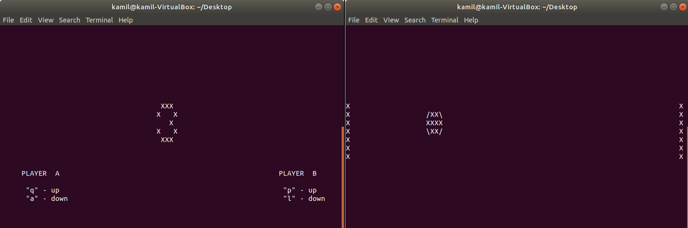

## Main
Scripts run and working on Linux Ubuntu 18.04

## Contents
* `Natwork` [Check_IPs](#Check_IPs)
* `Game` [Ping_Pong](#Ping_Pong)
* `Basic`[Folder_Search](#Folder_Search)
* `Basic` [Image_to_ANSI](#Image_to_ANSI)
* `Basic` [Lowercase_Files_Names](#Lowercase_Files_Names)
* `Basic` [Processes](#Processes)
* `Basic` [Site_Checker](#Site_Checker)
* `Basic` [System_Stats](#System_Stats)

## Topics
### Check_IPS
More info in [folder](Check_IPs).

### Ping_Pong
A Ping-Pong game for console. This is pretty self-explanatory.

### Folder_Search
Script design to collect data of words collected in directory subtree. With four different options, allows to (for each file) count all occurences in all files in folder, count amount of files in which occures and list all lines in which appears, along with filename and line number. Additionally allows aist all lines with word duplications in them, from all files in directory subtree.

### Image_to_ANSI
Script to download a photo of kitten from [API](https://api.thecatapi.com/v1/images/search) and display it in console using img2txt. Additionally, it displays a random Chuck Norris quote downloaded from [API](http://api.icndb.com/jokes/random).

### Lowercase_Files_Names
Script to change names of all files in given folder to lowercase.

### Processes
Script showing basic data about current working processes, such as process id (PID), parent process id (PPID), name, state and count.

### Site_Checker
Script checking site `$1` for changes every `$2` seconds and displaying message in console when change found.

### System_Stats
Sript showing basic data about PC, such as current download speed, how long is system up, on what percentage battery is and average system usage over 1-5-15 min.
