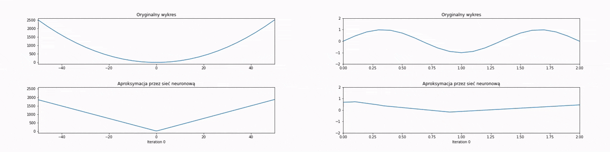

## Contents
* [Simulated_Anneling_Maze](#Simulated_Anneling_Maze)
* [Simulated_Anneling_Metrices](#Simulated_Anneling_Metrices)
* [Simulated_Anneling_Multidimentional_Function](#Simulated_Anneling_Multidimentional_Function)
* [Swarm_Optimalization_Multidimentional_Function](#Swarm_Optimalization_Multidimentional_Function)
* [Tabu_Search_Maze](#Tabu_Search_Maze)
* [Tabu_Search_Multidimentional_Function](#Tabu_Search_Multidimentional_Function)
* [Tabu_Search_TSP](#Tabu_Search_TSP)
* [Convert_Roman_to_Arabic](#Convert_Roman_to_Arabic)
* [Data_Framing](#Data_Framing)
* [DFS_BFS_Tree](#DFS_BFS_Tree)
* [Estimating_Net_Reliabality](#Estimating_Net_Reliabality)
* [Find_Repeting_Files](#Find_Repeting_Files)
* [Fourier_Transfrom_Multiplication](#Fourier_Transfrom_Multiplication)
* [Neural_Network_XOR](#Neural_Network_XOR)
* [Neural_Network_Function_Approximation](#Neural_Network_Function_Approximation)
* [Lowercase_Files_Names](#Lowercase_Files_Names)
* [Movie_Recomendation](#Movie_Recomendation)
* [Pascal_Triangle](#Pascal_Triangle)
* [RSA_Encryption_Decryption](#RSA_Encryption_Decryption)

## Topics
### Simulated_Anneling_Maze
More info in [folder](Simulated_Anneling_Maze).
### Simulated_Anneling_Metrices
More info in [folder](Simulated_Anneling_Metrices).
### Simulated_Anneling_Multidimentional_Function
More info in [folder](Simulated_Anneling_Multidimentional_Function).
### Swarm_Optimalization_Multidimentional_Function
More info in [folder](Swarm_Optimalization_Multidimentional_Function).
### Tabu_Search_Maze
More info in [folder](Tabu_Search_Maze).
### Tabu_Search_Multidimentional_Function
More info in [folder](Tabu_Search_Multidimentional_Function).
### Tabu_Search_TSP
More info in [folder](Tabu_Search_TSP).

### Convert_Roman_to_Arabic
Program to convert roman numbers to arabic.

### Data_Framing
Program to frame datastreams using bit-stuffing and CRC verification. Program has two commands:
* `python Data_Framing --frame Z W` <br/>
Program reads 0-1 stream from file Z, splits it to fit frames and adds headers etc. Then writes resulting frames to file W.
* `python Data_Framing --deframe W X` <br/>
Program reads stream from file W and writes content of frames to file X, as well as error messages such as [Didn't recieve this package] or [incorrect checksum for package].

### DFS_BFS_Tree
Implement DepthFirstSearch and BreadthFirstsearch on randomly generated binary tree.

### Estimating_Net_Reliabality
Estimate reliabality of network of given size, intensity and failur eprobability. The program also checks how the reliabality changes when one of the following atribites changes:
* intensity
* bandwidth
* network topology

### Find_Repeting_Files
Find and print duplicated files in given folder and subfolders. Two files are considered identical, if both have the same size and hash value.

### Fourier_Transfrom_Multiplication
Multiplication of big integers using Fourier Transform and three different algorithms (given by profesor, my own, numpy.fft).

### Neural_Network_XOR
Not using any neural network related module write from scratch a basic neural network. The purpose of which will be XOR function.
```
0 XOR 0 = 0
0 XOR 1 = 1
1 XOR 0 = 1
1 XOR 1 = 0
```
The model used is in shape 3-4-1. Three input neurons contain two variables for XOR function and one bias.

### Neural_Network_Function_Approximation
A neural network implemented using `Keras`, trained to approximate functions quadratic and sinusoids, but the model I created is easily adapted to any function. Model uses three layers with structure 1-10-10-1, and usual training takes 5000 epochs. After the training the program generates an animation of learning. Below is this animation as gif:

I used Jupyter Notebook so a lot of comments are inside, but it not always displays correctly on github.
**run:**<br/>
```
jupyter notebook Neural_Network_Function_Approximation.ipynb
```

### Lowercase_Files_Names
Algorithm changing all files name to lowercase in given directory and below.

### Movie_Recomendation
Using [Movie Latest Dataset](https://grouplens.org/datasets/movielens/latest/) I created a recomendation system for given user. Using movie ratings by different user the program aims to sort movies in order of possibility, that this movie will get high rating by another user. I used calculations on `sparse metrices` (because of the size of data). The first argument in `main`: `userId` means for which user the recommendations will be generated.

### Pascal_Triangle
A recurrent algorithm (optimized for time and memmory complexity) for creating pascal triangle.

### RSA_Encryption_Decryption
A program to cypher and decypher given file using RSA algorithm. To check if random number if prime use Miller-Rabin algorithm.<br/>
Program should allow generating public and private keys od any size:
Komenda: `python rsa.py --gen-keys 128` generuje 128-bitowe klucze `key.pub` oraz `key.prv`.
Encryptions run as follows:
```
python rsa.py --encrypt Python
```
and returns a string of encrypted data. Taking this string and decrypting it with:
```
python rsa.py --decrypt 21437302530112407657289772777280768429
```
returns a starting message: `Python`.
