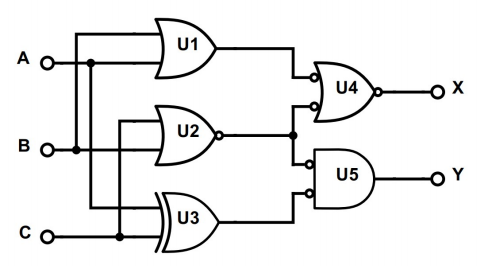

# Unit 1
This gate takes 3 bits in (`a`, `b`, `c`), and outputs two bits with result (`x`, `y`).

Test bench checks all 8 options for sending one bit each:
| a | b | c | x | y |
|:-:|:-:|:-:|:-:|:-:|
|0|0|0|0|0|
|0|0|1|0|0|
|0|1|0|0|1|
|0|1|1|0|0|
|1|0|0|1|0|
|1|0|1|0|1|
|1|1|0|0|0|
|1|1|1|1|1|
