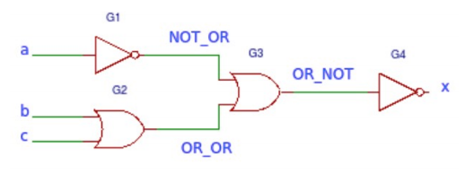

# Unit 2
This gate takes 3 bits in (`a`, `b`, `c`), and outputs one bit with result (`x`).

Test bench checks all 8 options for sending one bit each:
| a | b | c | x |
|:-:|:-:|:-:|:-:|
|0|0|0|0|
|0|0|1|0|
|0|1|0|0|
|0|1|1|0|
|1|0|0|1|
|1|0|1|0|
|1|1|0|0|
|1|1|1|0|
