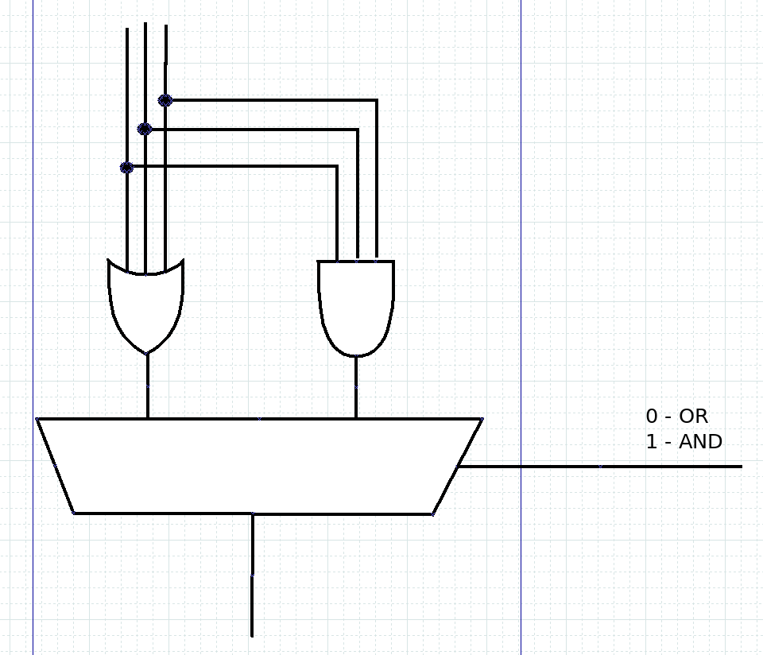

# Variable AND OR
This gate takes 3 bits in (`a`, `b`, `c`), and one bit that changes output (`s0`) and outputs one bit with result (`x`).

If `s0 == 0` the unit performs OR operation, else performs AND operation on signals `a`, `b`, `c`.

Test bench checks some of the possible input options:
| a | b | c | s0 | x |
|:-:|:-:|:-:|:--:|:-:|
|0|0|0|0|0|
|0|0|1|0|1|
|0|0|0|1|0|
|1|1|1|1|1|
